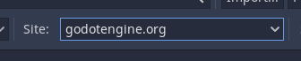

# Camping Trip
A Godot Wild Jam #47 gamejam game. Theme was "Symmetry".

Made in Godot 3.4.4

## Installation
### Addons
* Heightmap terrain - Zylann
* Scene scattering tool - Zylann
* Wwise Godot Integration - alessandrofama

#### Instructions
1. Open the Asset Lib window in Godot.  
2. Make sure you are searching godotengine.org.  
3. Search for "terrain" and select `Heightmap terrain`.  
4. In the details window for the plugin, select download.  
5. Let the plugin download and then start the install...  
6. Let the plugin install in `/addons/zylann.hterrain/`.  
7. Return to the Asset Lib window.
8. Search for "scatter" and select `Scene scattering tool`. 
9. Follow steps 4-5.
10. Let the plugin install in `/addons/zylann.scatter/`.
11. Reload the project.  

Currently, the wwise-godot-integration plugin is included in the repo for our convenience in development.
We will probably remove it eventually. 

Library files for specific machines are still required to be downloaded separately for Wwise to work.

#### Wwise
The project requires that `addons/wwise/bin/` be populated
with the build of Wwise for your specific hardware.
1. Go to https://github.com/alessandrofama/wwise-godot-integration/releases
2. Download the zip for your system (ie. Win64, MacOS, Linux).
3. Unzip the archive.
4. From the archive, navigate down until you see two folders `debug` and `release`.
5. Go up one folder.
6. Copy the folder (ie. `win64`, `linux`)
7. Navigate to `addons/wwise/bin/` from your project root directory.
8. Paste folder into the directory. 
   1. Resulting structure should look similar to the following:
   `/addons/wwise/bin/linux/debug/libWwiseGDNative.so`
   `/addons/wwise/bin/linux/release/libWwiseGDNative.so`
9. Open the Godot project.
10. Open the `Project Settings` menu.
11. Open the `Plugins` tab.
12. Make sure `Wwise` has checked `Enable`. 
13. Open the `AutoLoad` tab.
14. 3 Wwise related scripts should be checked `Enable`.
15. The current main scene should have some Wwise integrated nodes in it.